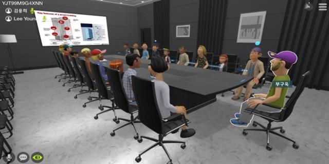

# 아이디어 계획서
## 주제
- 영어 스터디 + 메타버스
- Transcend Me (가제): 나를 초월한다.
- 나를 대신하는 아바타를 통해 영어를 공부한다.
- 영어 공부를 마치 게임하는 것처럼 느껴질 수 있도록 하는 것이 목표

## 먼저 메타버스란?
- 메타버스 (Metaverse)
- 현실에서의 상호작용을 가상 공간에 구현한 여러 컨텐츠를 통칭
- 메타버스를 기존의 플랫폼이나 어플리케이션과 혼동하면 안됨
- 차별화된 고유 특징 5가지
    1) 세계관(Canon)
    2) 창작자(Creator)
    3) 디지털 통화(Currency)
    4) 일상의 연장(Continuity)
    5) 연결(Connectivity)

## 기능 설명
### 기능 1: 전화 매칭
- 두어명 정도 방을 만들어 매칭, 서로 영어 통화를 할 수 있는 기능
- 반드시 영어로 소통해야 함, 한국어가 들릴 경우 자동으로 out 처리
- **한국어 음성 인식 기능**: 음성 인식 Open API를 사용하면 될 것으로 예상
- 돈 드는 전화 영어에 비해 부담을 덜 수 있지 않을까
- 대신 레벨이 맞아야 함으로 본인의 레벨 혹은 해당 방 레벨을 지정

### 기능 2: 모임
- 오프라인 모임이 힘든 사람들끼리 온라인 모임을 통해, 마치 오프라인 모임인 것처럼 스터디할 수 있는 기능
- 각 모임마다 시간 및 목표를 정해 스터디를 진행하는 방식
- 줌(Zoom)을 캐릭터화 했다고 생각하면 됨

### 기능 3: 커뮤니티
- 카테고리: 잡담, 팁/자료, 질문, 정리글, 기타 등
- 서로의 고민을 이야기하거나, 나만의 팁을 공유, 온라인/오프라인 스터디 정보 공유
- 다만 해당 커뮤니티를 어떻게 메타버스에 녹일 것이냐가 관건

### 기능 4: 습관 들이기
- 저마다의 계획을 세워 다른 사람들과 공유
- 인증을 올려 서로를 격려/칭찬하며 의지를 다짐
- 이 또한 어떻게 메타버스에 녹일 것인지 고민, 기능 3과 합쳐야 할지

### 기능 5: 게임
- 캐릭터를 통해 게임을 진행하면서 본인의 레벨을 측정할 수 있도록 함
    1) Two truths and a lie
        - 세 가지 문장 중 하나의 거짓말을 밝혀내는 게임

    2) I have never
        - I have never로 시작하는 문장을 만들어 말하고 해당 경험이 있는 사람들끼리 자리를 바꿈, 못 바꾸는 사람이 문장을 이어 말하는 게임

    3) In the manner of the word
        - gracefully나 sleepily와 같은 부사를 정해 한 사람이 설명하고 나머지 사람들이 맞추는 게임

    4) I’m going on a picnic
        - I'm going on a picnic으로 시작하여 a부터 z까지의 단어를 사용하여 문장을 이어 나가는 게임
        - ex) I'm going on a picnic, and I'm bringing apples.
        - ex) I'm going on a picnic, and I'm bringing apples and bananas.

    5) 20 Questions
        - 스무고개 게임, 질문에는 Yes or No 로만 대답 가능

### 이 외
- 메타버스 서비스 특성 상 아웃 게임 개발에도 힘 써야 함
- 캐릭터 및 방 꾸미기, 맵 구성하기 등 ...

### 우려사항
- 메타버스 플랫폼 자체가 용량이 큼, 네트워크 접속이 안정적이어야 할 듯
- 우리가 이 서비스를 운영할 정도의 능력이 되는지
- 기능들이 비교적 간단함