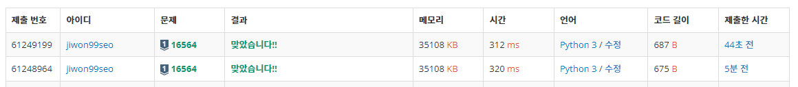

# Week 08

## 문제 리스트

|                |문제번호|난이도|문제제목|혼자 풀었나요?|
|----------------|-------|------|-------|-------------|
|5/24(수)|16564|실버1|히오스 프로게이머|O|
||8983||사냥꾼||
||2630||색종이 만들기||

## 문법, 알고리즘 정리
### 생각해보기 1
- 매 반복마다 최대값 (혹은 최소값)을 갱신하는 것이 빠른가,
- 리스트에 넣고 마지막에 max or min으로 값을 얻는 것이 더 빠른가?
- 아래 (320ms)가 매 반복마다 값을 갱신한 코드, 위 (312ms)가 리스트에 넣고 마지막에 값을 얻은 경우
- **즉 리스트에 넣고 max() or min()으로 구하는 것이 빠르다.**
<p align="center"></p>

### 생각해보기 2
- 나무 자르기 문제(1300) 관련
```
import sys
input = sys.stdin.readline

# 나무 수 n, 가져가려는 나무 길이 m
n, m = map(int, input().split())

# 나무 길이들
values = list(map(int, input().split()))

# 절단기 설정 높이의 최소, 최대값
minvalue = 0
maxvalue = max(values)

result = 0

while minvalue <= maxvalue:
	mid = (minvalue + maxvalue) // 2

	length = 0

	for value in values:
		if value - mid > 0:
			length += value - mid

	# "적어도" m미터 나무를 가져가야 함
	# 즉 넘쳐도 됨

	if length >= m:
		result = mid
		minvalue = mid + 1
	else:
		maxvalue = mid - 1

print(result)
```
- 해당 코드를 그대로 백준에 적용하면 시간초과
```
import sys
input = sys.stdin.readline

# 나무 수 n, 가져가려는 나무 길이 m
n, m = map(int, input().split())

# 나무 길이들
values = list(map(int, input().split()))

def solve():
    # 절단기 설정 높이의 최소, 최대값
    minvalue = 0
    maxvalue = max(values)

    result = 0

    while minvalue <= maxvalue:
        mid = (minvalue + maxvalue) // 2

        length = 0

        for value in values:
            if value - mid > 0:
                length += value - mid

        # "적어도" m미터 나무를 가져가야 함
        # 즉 넘쳐도 됨

        if length >= m:
            result = mid
            minvalue = mid + 1
        else:
            maxvalue = mid - 1

    return result

print(solve())
```
- 함수를 만들어 호출하는 방식으로 사용하면 통과
- **파이썬 및 다른 언어에서 함수를 사용하면 더 빠르게 처리된다는 말은 일절 없음**

### 생각해보기 3
```
(생략)

def pick(x, tmp):
    global cnt
    if x == 0:
        if tmp == s:
            cnt += 1
            return
        else:
            return
    
    for i in range(n):
        if not visited[i]:
            visited[i] = True
            tmp += nums[i]
            x -= 1
            pick(x,tmp)
            x += 1
            tmp -= nums[i]

for i in range(1,n+1):
    visited = [False]*n
    pick(i, 0)

print(cnt)
```
- 준코 dfs 빠져나온 후 왜 다시 false 처리 해주어야 하나?
- **안해주면 이전에 true 처리해줬던 값을 다시 확인하지 않음**

### K번째 수 문제 풀이
- 해당 문제에 어떤 방식으로 이분 탐색을 적용해야 하나
- k번째 수는 k보다 클 수 없음 -> start = 0, end = k
- **mid보다 작거나 같은 수의 개수를 구하면 됨**